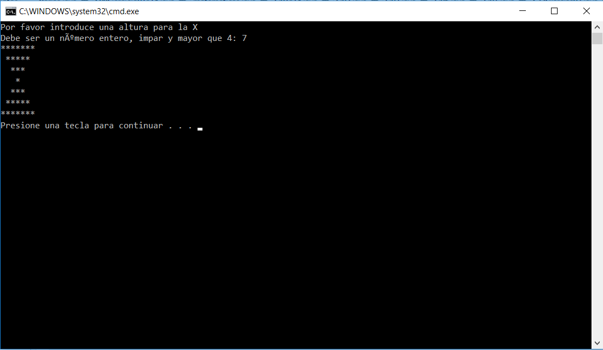
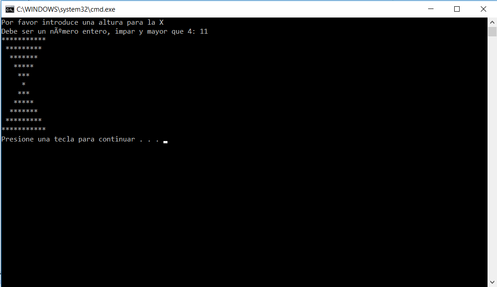

# Mi programa favorito en java
El transcurso por el camino de la programación es largo y tedioso pero a medida que avanzas
se hace más satisfactorio cada día.
Es un placer aprender java porque aunque no sea el lenguaje más fácil ni más dificil, hay que
cuidar los pequeños fallos y es un nivel bueno para empezar.

## Hasta ahora, los ejercicos que más me han gustado son los de "pintar",
como hay que elegir voy a optar por un ejercicio en el que se pinta un reloj de arena:

``` java

/**
 * Capítulo 5, Ejercicio 38
 *
 * @author David.B.M.
 */


public class Ej38 {
  public static void main (String[] args) {
	System.out.println("Por favor introduce una altura para la x:");
    System.out.print("Debe ser un número entero, impar y mayor que 4: ");
    int num = Integer.parseInt(System.console().readLine());
    int espaciosAntesArriba = 0;
    int arriba = num / 2;
    int espaciosAntesAbajo = arriba;
    int contar = 1;
    int asteriscosArriba = num;
    int asteriscosAbajo = 3;
    if ((num < 5) || ((num % 2) == 0)) {
      System.out.print("Es menor a 5 o par");
    } else {
      while (contar <= arriba) {
        for (int contador = 1; contador <= espaciosAntesArriba; contador++) {
          System.out.print(" ");
        }
        for (int  contador = 1; contador <= asteriscosArriba; contador++) {
          System.out.print("*");
        }
        System.out.println();
        espaciosAntesArriba++;
        contar++;
        asteriscosArriba = asteriscosArriba - 2;
      }
      for (int contador = 1; contador <= arriba; contador++) {
          System.out.print(" ");
      }
      System.out.println("*");
      while (contar < num) {
        for (int contador = 1; contador < espaciosAntesAbajo; contador++) {
          System.out.print(" ");
        }
        for (int contador = 1; contador <= asteriscosAbajo; contador++) {
          System.out.print("*");
        }
        System.out.println();
        contar++;
        espaciosAntesAbajo--;
        asteriscosAbajo = asteriscosAbajo + 2;
      }
    }
  }
}
```
## Aquí podemos observar un par de ejemplos de la ejecución del programa:



